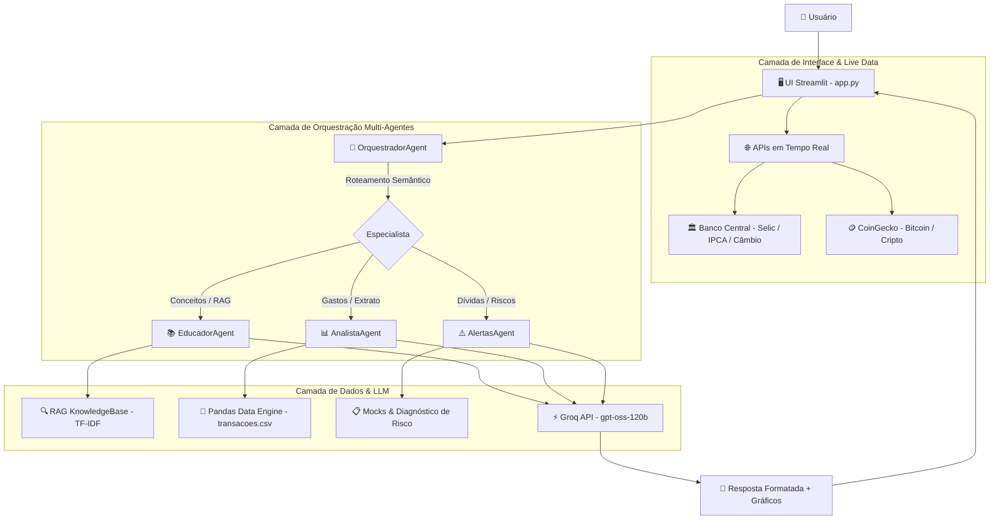

# 💼 Rex — Conselheiro Financeiro Inteligente

> **Sistema Multi-Agentes com RAG (Retrieval-Augmented Generation), análise quantitativa de despesas em Pandas e integração em tempo real com APIs do Banco Central e Mercado Financeiro.**

[](https://www.python.org/)
[](https://streamlit.io/)
[](https://groq.com/)
[](https://pandas.pydata.org/)
[](https://scikit-learn.org/)

---

## 💡 Sobre o Projeto

O **Rex** (do latim *regere*, "guiar") é um assistente financeiro avançado projetado para democratizar a consultoria e educação financeira de forma didática, analítica e personalizada. 

Diferente de chatbots genéricos, o Rex implementa um ecossistema **Multi-Agentes** com roteamento inteligente, ancoragem de dados reais (RAG semântico), relatórios numéricos via Pandas e alertas proativos de saúde financeira.

### 🌟 Diferenciais de Engenharia:
- **Arquitetura Multi-Agentes Especializada:**
  - 🔀 **Orquestrador Central:** Classifica a intenção da dúvida e direciona para o especialista mais adequado.
  - 📚 **Agente Educador:** Explica conceitos, produtos de investimento e regras de mercado com base em RAG e cotações reais.
  - 📊 **Agente Analista:** Processa dados tabulares e extratos com **Pandas**, calculando médias, centros de custo e gerando gráficos interativos.
  - ⚠️ **Gestor de Risco e Alertas:** Monitora riscos críticos (cheque especial, juros do cartão rotativo e insuficiência de reserva de emergência).
- **RAG Semântico em Tempo Real:** Motor de busca vetorial baseado em TF-IDF e Similaridade de Cosseno sobre produtos e diretrizes financeiras, sem alucinação.
- **APIs Econômicas Conectadas:** Ingestão de taxas oficiais do **Banco Central do Brasil (SGS)** — Selic, IPCA e Dólar PTAX — e cotações de criptoativos (**CoinGecko**) com cache de alta performance.
- **Segmentação Completa PF & PJ:** Perfis para iniciantes até investidores avançados, e para MEI até empresas atacadistas.

---

## 🏗️ Arquitetura do Sistema



---

## 📁 Estrutura do Diretório

```
Agente_de_Finanças/
├── .env.example                # Modelo de variáveis de ambiente
├── .gitignore                  # Arquivos ignorados pelo Git
├── README.md                   # Documentação completa do projeto
├── requirements.txt            # Dependências Python
├── data/                       # Base de dados, transações e perfis
│   ├── mock/                   # Perfis em JSON (PF e PJ)
│   ├── transacoes.csv          # Histórico de transações para análise com Pandas
│   ├── produtos_financeiros.json # Catálogo de produtos para RAG
│   └── historico_atendimento.csv
├── docs/                       # Documentação técnica de apoio
│   ├── 01-documentacao-agente.md
│   ├── 02-base-conhecimento.md
│   ├── 03-prompts.md
│   ├── 04-metricas.md
│   └── progresso.md            # Histórico das Sprints concluídas
└── src/                        # Código-fonte da aplicação
    ├── app.py                  # Aplicação Web Streamlit com Dashboard
    ├── agents/                 # Ecossistema Multi-Agentes
    │   ├── base_agent.py       # Classe base e sanitização de texto
    │   ├── orquestrador.py     # Classificador de intenções e roteador
    │   ├── educador.py         # Agente Educador com RAG
    │   ├── analista.py         # Agente Analista com motor Pandas
    │   └── alertas.py          # Agente Gestor de Riscos
    ├── api/                    # Conectores com APIs externas
    │   ├── banco_central.py    # Cliente da API SGS do Banco Central
    │   └── market_api.py       # Cotações de Bitcoin e Ibovespa
    ├── prompts/                # Prompts estruturados por persona
    │   ├── pf_iniciante.txt
    │   ├── pf_intermediario.txt
    │   ├── pf_avancado.txt
    │   ├── pj_mei.txt
    │   ├── pj_pequena.txt
    │   ├── pj_media.txt
    │   └── pj_atacado.txt
    └── rag/                    # Motor de busca semântica
        └── knowledge_base.py   # RAG via vetorização TF-IDF e Similaridade Cosseno
```

---

## 🚀 Como Executar o Projeto

### 1. Clonar o Repositório
```bash
git clone https://github.com/FlyingHigh520741/dio-lab-bia-do-futuro.git
cd dio-lab-bia-do-futuro
```

### 2. Configurar o Ambiente Virtual
```bash
# Windows
python -m venv venv
.\venv\Scripts\activate

# Linux / MacOS
python3 -m venv venv
source venv/bin/activate
```

### 3. Instalar as Dependências
```bash
pip install -r requirements.txt
```

### 4. Configurar a Chave da API
Crie um arquivo `.env` na raiz do projeto contendo sua chave gratuita da [Groq Cloud](https://console.groq.com/):
```env
GROQ_API_KEY=sua_chave_groq_aqui
```

### 5. Iniciar a Aplicação
```bash
streamlit run src/app.py
```
Acesse a aplicação no seu navegador em `http://localhost:8501`.

---

## 🎯 Demonstrações de Uso

### 1. Dúvida Conceitual com RAG (Atendimento via 📚 Educador)
> **Usuário:** "O que é CDI e qual a diferença para a Selic hoje?"  
> **Rex (Educador):** Consulta a API do Banco Central (Selic atual), busca a definição no módulo RAG e explica de forma simples a relação entre as duas taxas sem alucinações.

### 2. Análise Quantitativa de Extrato (Atendimento via 📊 Analista)
> **Usuário:** "Onde estou gastando mais este mês?"  
> **Rex (Analista):** Processa o arquivo `transacoes.csv` com Pandas, calcula totais e percentuais, apresenta os maiores centros de custo e renderiza um gráfico de barras interativo na interface.

### 3. Detecção Preventiva de Risco (Atendimento via ⚠️ Alertas)
> **Usuário:** "Devo investir ou pagar meu cartão?"  
> **Rex (Alertas):** Detecta a presença de dívidas no rotativo e no cheque especial do perfil, alertando com firmeza sobre as taxas predatórias e priorizando a quitação antes de aportes de risco.

---

## 👨‍💻 Autor & Portfólio
Desenvolvido como projeto de portfólio focado em **Engenharia de Dados**, **LLMOps**, **Sistemas Multi-Agentes** e **RAG Aplicado**.
