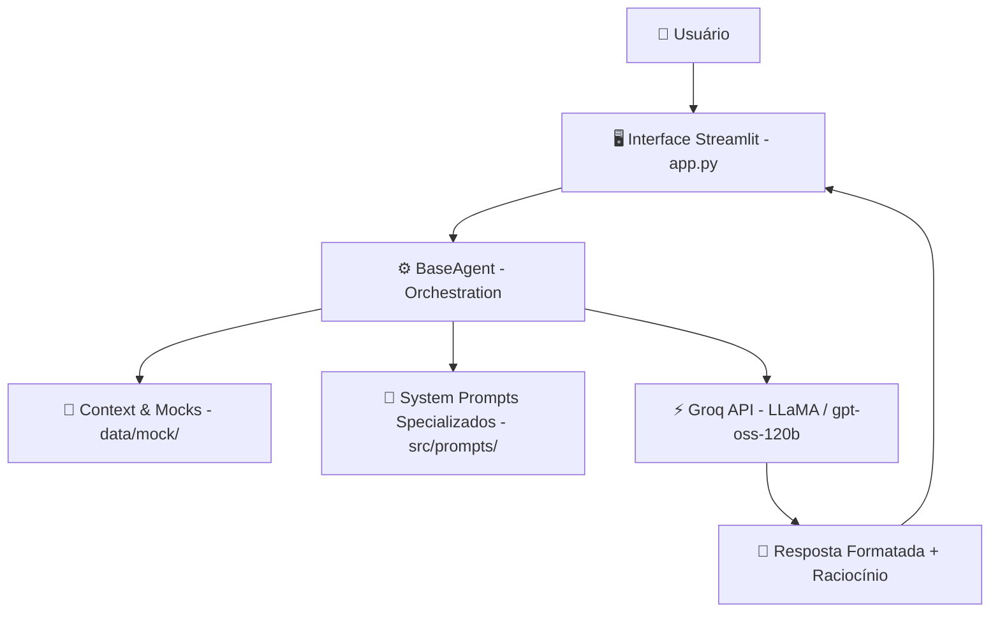

# 💼 Rex — Conselheiro Financeiro Inteligente

> Agente de Inteligência Artificial Generativa e Engenharia de Dados para auxílio financeiro personalizado, atendendo perfis de **Pessoa Física (PF)** e **Pessoa Jurídica (PJ)** com base em dados mockados e inteligência preditiva/consultiva.

---

## 💡 Sobre o Rex

O **Rex** (do latim *regere*, "guiar") é um conselheiro e educador financeiro multi-perfil construído para oferecer orientação financeira contextualizada e segura. Ele adapta suas respostas dinamicamente com base no perfil do usuário (PF ou PJ) e no seu momento financeiro.

### 🌟 Diferenciais do Rex:
- **Segmentação Precisa:** Atende desde investidores iniciantes até empresas atacadistas de grande porte.
- **Suporte Multi-Perfil:**
  - **Pessoa Física:** Iniciante, Intermediário e Avançado.
  - **Pessoa Jurídica:** MEI / Autônomo, Pequena Empresa, Média Empresa e Atacado / Distribuidor.
- **Segurança & Anti-Alucinação:** Sistema de prompt englobando 6 regras rígidas de segurança, formatação numérica limpa e isolamento de raciocínio `<think>`.
- **Arquitetura Escalável:** Preparado para integrar RAG (banco vetorial ChromaDB) e conectores de APIs financeiras reais (BCB, BrasilAPI, Brapi, CoinGecko).

---

## 🏗️ Arquitetura do Sistema



### 🛠️ Stack Tecnológica
- **Linguagem:** Python 3.11+
- **Frontend / UI:** [Streamlit](https://streamlit.io/)
- **LLM Engine:** [Groq Cloud API](https://groq.com/) (`openai/gpt-oss-120b` / LLaMA 3)
- **Manipulação de Dados:** Pandas
- **Configuração & Variáveis:** `python-dotenv`

---

## 📁 Estrutura do Projeto

```
dio-lab-bia-do-futuro/
├── .env.example                # Template para variáveis de ambiente
├── .gitignore                  # Arquivos ignorados pelo Git
├── README.md                   # Documentação principal do repositório
├── requirements.txt            # Dependências do projeto Python
├── data/                       # Base de conhecimento e mocks
│   ├── mock/                   # Perfis mockados em JSON (PF e PJ)
│   ├── historico_atendimento.csv
│   ├── perfil_investidor.json
│   ├── produtos_financeiros.json
│   └── transacoes.csv
├── docs/                       # Documentação detalhada e planejamento
│   ├── 01-documentacao-agente.md
│   ├── 02-base-conhecimento.md
│   ├── 03-prompts.md
│   ├── 04-metricas.md
│   ├── 05-pitch.md
│   └── progresso.md            # Planejamento das Sprints e Roadmap
└── src/                        # Código fonte da aplicação
    ├── app.py                  # Aplicação Web (Streamlit)
    ├── agents/
    │   └── base_agent.py       # Classe base do agente conversacional
    └── prompts/                # Prompts especializados para cada perfil
        ├── pf_iniciante.txt
        ├── pf_intermediario.txt
        ├── pf_avancado.txt
        ├── pj_mei.txt
        ├── pj_pequena.txt
        ├── pj_media.txt
        └── pj_atacado.txt
```

---

## 🚀 Como Executar o Projeto

### 1. Clonar o Repositório
```bash
git clone https://github.com/FlyingHigh520741/dio-lab-bia-do-futuro.git
cd dio-lab-bia-do-futuro
```

### 2. Configurar o Ambiente Virtual Python
```bash
# Windows
python -m venv venv
.\venv\Scripts\activate

# Linux / MacOS
python3 -m venv venv
source venv/bin/activate
```

### 3. Instalar Dependências
```bash
pip install -r requirements.txt
```

### 4. Configurar as Variáveis de Ambiente
Crie um arquivo `.env` na raiz do projeto com a sua chave da API Groq:
```env
GROQ_API_KEY=sua_chave_groq_aqui
```

### 5. Executar a Aplicação Streamlit
```bash
streamlit run src/app.py
```

---

## 🗺️ Roadmap de Desenvolvimento (Sprints)

- [x] **Sprint 1 — Fundação & MVP (Concluído)**
  - Estruturação modular (`agents`, `prompts`, `mock data`).
  - Integração com a Groq API.
  - Interface Streamlit com Onboarding interativo para PF e PJ.
  - Implementação do `BaseAgent` com sanitização de texto e parsing de raciocínio `<think>`.
- [ ] **Sprint 2 — RAG & APIs em Tempo Real (Próximo Passo)**
  - Banco vetorial ChromaDB com `sentence-transformers`.
  - Integração com Banco Central (BCB SGS), BrasilAPI, Brapi (B3) e CoinGecko.
- [ ] **Sprint 3 — Arquitetura Multi-Agentes Orquestrada**
  - Roteador / Orquestrador central.
  - Agentes especializados: *Educador*, *Analista de Dados* (Pandas), *Alertas de Risco*.
- [ ] **Sprint 4 — Refinamento de Portfólio & Métricas**
  - Avaliação de assertividade/anti-alucinação.
  - Cobertura de testes e documentação final de entrega.

---

## 📄 Licença
Este projeto é distribuído para fins educacionais e de portfólio no âmbito dos desafios da **DIO (Digital Innovation One)**.
